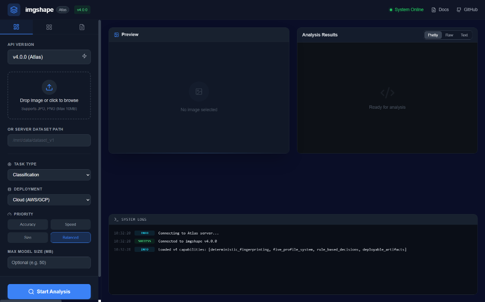
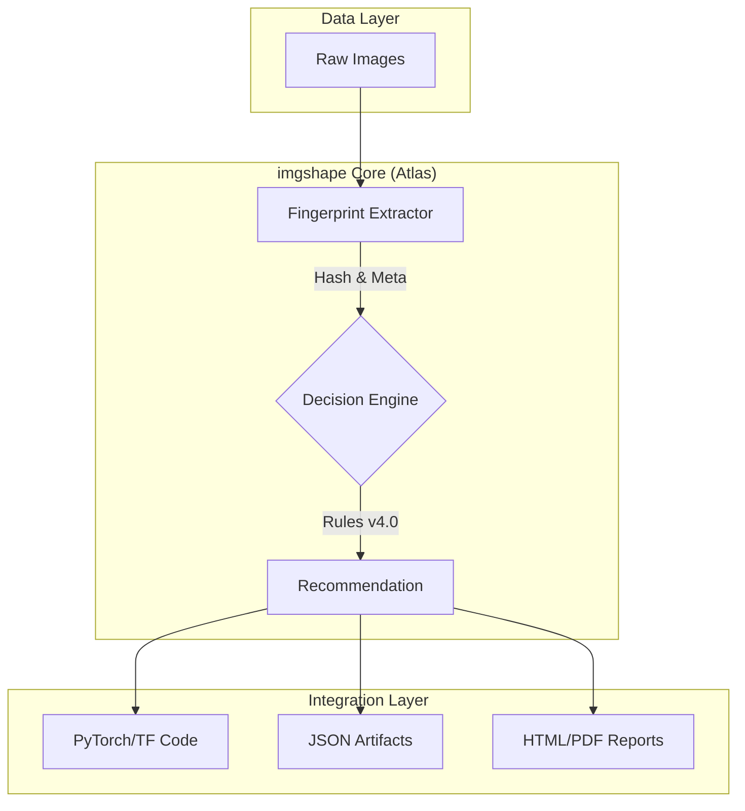

<div align="center">

# 🖼️ imgshape
### The Data-Centric AI Toolkit for Vision Engineers

[](https://pypi.org/project/imgshape/)
[](https://pypi.org/project/imgshape/)
[](https://pepy.tech/project/imgshape)
[](https://streamlit.io)

<br/>

> **"Automatically analyze any image dataset and get *model-ready preprocessing recommendations* in one command."**

<br/>

[**🚀 Live Demo (Web)**](https://imgshape.vercel.app/) • [**📖 Documentation**](https://github.com/STiFLeR7/imgshape/blob/master/README.md) • [**💬 Report Bug / Discuss**](https://github.com/STiFLeR7/imgshape/discussions)

</div>

---

## ⚡ 30-Second Start

Don't guess your dataset's health. **Audit it immediately** with the `Atlas` engine.

```python
pip install imgshape

from imgshape import Atlas

# 1. Initialize the Atlas Orchestrator
atlas = Atlas()

# 2. Extract deterministic fingerprint
result = atlas.extract_fingerprint("./my_dataset")

# 3. View the verdict
print(result.summary())
```

**System Output:**
```json
{
  "fingerprint_id": "fp_8a7d9f2",
  "total_images": 4502,
  "corrupt_files": 12,
  "metrics": {
    "avg_resolution": "1024x768",
    "diversity_score": 0.89,
    "channel_consistency": "FAIL"
  },
  "issues": ["Found 14 grayscale images in RGB dataset"]
}
```

---

## 🔍 The Visual Dashboard (Atlas UI)

Experience `imgshape`'s capabilities visually. The dashboard provides a real-time interface for **dataset fingerprinting**, **augmentation previews**, and **pipeline configuration**.



> *Dashboard v4.0.0 showing Atlas API Version, Task Type selection, and System Logs.*

---

## 🚀 Why imgshape?

Most vision models fail because of **garbage data**—corrupt files, mixed channels (RGBA vs RGB), or weird aspect ratios. `imgshape` catches these *before* you train using a deterministic rule engine.

| Module | Technical Function |
| :--- | :--- |
| **🔍 Instant Audit** | Multi-threaded scan for corruption, outliers, and duplicates using high-performance IO. |
| **🧠 Decision Engine** | Heuristic-based suggestion engine (`Atlas DecisionLayer`) for `Resize`, `Normalize`, and `Augment`. |
| **🛠️ Pipeline Export** | Generates serialization-safe code for **PyTorch**, **TensorFlow**, and **Albumentations**. |
| **🎨 Visual Studio** | Local **Streamlit** instance for interactive augmentation testing and hypothesis verification. |

---

## 📦 Installation Matrix

Choose your deployment flavor.

| Command | Use Case | Size |
| :--- | :--- | :--- |
| `pip install imgshape` | **Core / CI/CD** | ~12MB |
| `pip install "imgshape[full]"` | **Research / Power User** | ~45MB |
| `pip install "imgshape[ui]"` | **Interactive / Dashboard** | ~30MB |

---

## 💡 Practical Use Cases

### 1. The "Sanity Check" (CI/CD Integration)
Block bad data from entering your training bucket. Ideal for GitHub Actions or Jenkins.
```bash
# Returns exit code 1 if corrupt files or schema violations are found
imgshape --check ./new_batch_v2 --strict-schema
```

### 2. The "Pipeline Builder"
Don't guess augmentation parameters. Let the entropy statistics decide.
```bash
# analyze -> recommend -> export PyTorch snippet
imgshape --path ./train_data --analyze --recommend --out transforms.py
```

### 3. The "Visual Explorer"
Verify `RandomCrop` or `ColorJitter` intensity manually before training.
```bash
# Launches local studio with auto-reload
imgshape --web --reload
```

---

## 🏗️ Architecture & Internal Mechanics

`imgshape` (Aurora Engine) operates on a **Fingerprint-Analyze-Decide** loop, acting as a middleware between raw storage and compute.



### Core Components
*   **Atlas Orchestrator:** The central intent-driven API that manages the lifecycle of an analysis session.
*   **Fingerprint Extractor:** A stateless module that computes immutable signatures for datasets (distributions, channel counts, hashes).
*   **Decision Engine:** A rule-based system that maps dataset signatures + User Intent (e.g., "Speed" vs "Accuracy") to concrete preprocessing steps.

---

## 🤝 Community & Support

*   **Issues**: Found a bug? [Open an issue](https://github.com/STiFLeR7/imgshape/issues).
*   **Discussions**: Feature requests? [Join the discussion](https://github.com/STiFLeR7/imgshape/discussions).

<div align="center">

*Built by [Stifler](https://github.com/STiFLeR7) for the AI Engineering community.*

**[Star on GitHub](https://github.com/STiFLeR7/imgshape) ⭐** — it helps more people find clean data.

</div>
