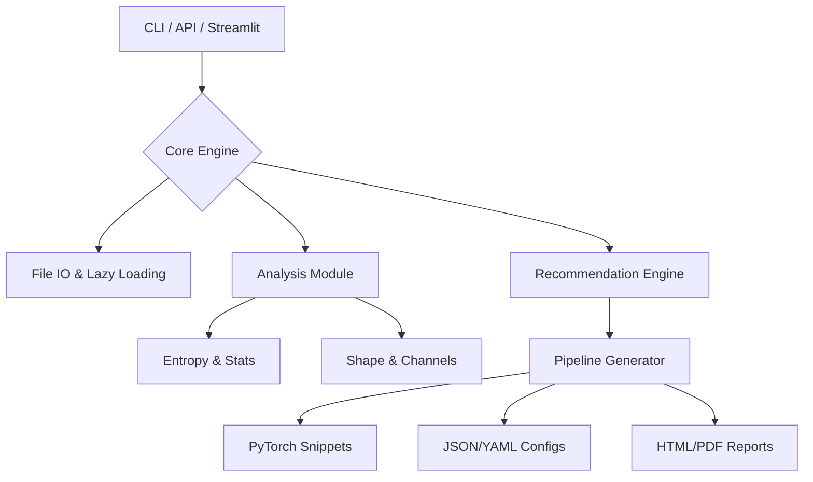

<div align="center">

# 🖼️ imgshape
### The Data-Centric AI Toolkit for Vision Engineers

[](https://pypi.org/project/imgshape/)
[](https://pypi.org/project/imgshape/)
[](https://pepy.tech/project/imgshape)
[](https://github.com/STiFLeR7/imgshape/blob/main/LICENSE)
[](https://streamlit.io)
[](https://github.com/psf/black)

<br/>


<br/>

**Transform raw images into actionable intelligence.**<br/>
*Auditing • Profiling • Recommendation • Pipeline Export*

[**Explore Docs**](https://stifler7.github.io/imgshape/) • [**Report Bug**](https://github.com/STiFLeR7/imgshape/issues) • [**Request Feature**](https://github.com/STiFLeR7/imgshape/issues)

</div>

---

## ⚡ What is imgshape?

**imgshape (v3.0.0 Aurora)** is a modular intelligence engine designed for modern **Computer Vision** workflows. It bridges the gap between raw data collection and model training by providing:

1.  **Deep Dataset Auditing**: Scan gigabytes of image data for corruption, channel inconsistency, and entropy distribution.
2.  **Smart Recommendations**: Uses statistical analysis to suggest optimal preprocessing steps (resize, normalization, augmentation).
3.  **Pipeline Export**: Instantly generate production-ready code for **PyTorch**, **Albumentations**, or **TensorFlow**.
4.  **Visual Dashboard**: A fully integrated **Streamlit** GUI for real-time augmentation testing and dataset exploration.

> *"Models are only as good as the data they see. imgshape ensures your models see clarity."*

---

## 🏗️ Architecture

imgshape is built on a **plugin-first architecture**, allowing seamless extension of analyzers, recommenders, and exporters.



---

## � Key Features

| Feature | Description |
| :--- | :--- |
| **🔍 Intelligent Audit** | Smart traversal of datasets to identify non-readable files, outliers, and distribution shifts. |
| **🧠 Recommendation Engine** | Automatically suggests `Resize`, `Normalize`, and `Augment` parameters based on *actual* data statistics. |
| **🎨 Interactive Visualizer** | Test augmentation chains in real-time using the built-in **Streamlit** dashboard. |
| **📄 Automated Reporting** | Generate executive-level **HTML/PDF reports** with histograms, sample previews, and health scores. |
| **🔌 Plugin System** | Extend capabilities with custom plugins for domain-specific pre-processing (Medical, Satellite, etc.). |
| **🛠️ Edge Ready** | Export optimized pipelines for deployment constraints. |

---

## 📦 Installation

Install the core package via PyPI:

```bash
pip install imgshape
```

### 💎 Power User Installation
For the full experience (including **PyTorch** integration, **PDF** reports, and **Advanced Viz**):

```bash
pip install "imgshape[full]"
```

*Other options: `[torch]`, `[ui]`, `[pdf]`, `[viz]`*

---

## 💻 Usage

### 1. The Command Line Interface (CLI)
Designed for CI/CD pipelines and quick checks.

```bash
# 🧠 Analyze a single image and get recommendations
imgshape --path dataset/train/001.jpg --analyze --recommend

# 📊 Generate a full dataset health report
imgshape --path ./datasets/cats_vs_dogs --report --report-format md,html

# 🛠️ Export a PyTorch transform pipeline based on dataset stats
imgshape --path ./datasets/cats_vs_dogs --torchloader --out transforms.py
```

### 2. The Visual Dashboard (Streamlit)
Launch the interactive studio:

```bash
imgshape --web
# OR
streamlit run app.py
```

---

## 🧑‍💻 Python API

Seamlessly integrate intelligence into your training scripts.

```python
from imgshape.pipeline import RecommendationPipeline
from imgshape.recommender import recommend_preprocessing

target_image = "assets/sample.jpg"

# 1. Get AI-driven recommendations
rec = recommend_preprocessing(target_image)

# 2. Build a deployable pipeline
pipeline = RecommendationPipeline.from_recommender_output(rec)

# 3. Export to dictionary or code
print(f"Recommended Pipeline Status: {pipeline.status}")
print(pipeline.as_dict())
```

---

## 🧩 Plugins & Extension

Create custom logic for your specific domain requirements.

```columns
<div align="center">

**Create Plugin**
```python
# src/imgshape/plugins/my_plugin.py
from imgshape.plugins import RecommenderPlugin

class HDRPlugin(RecommenderPlugin):
    NAME = "HDR_Enhance"
    def recommend(self, analysis):
        # Implementation
        return [{"op": "tone_map"}]
```

</div>

<div align="center">

**Register Plugin**
```bash
imgshape --plugin-add ./my_plugin.py
```

</div>
```

---

## 🤝 Contributing

We welcome contributions from the community! Please read our [Contributing Guide](CONTRIBUTING.md) for details on our code of conduct and the process for submitting pull requests.

1.  Fork the repo
2.  Create your feature branch (`git checkout -b feature/amazing-feature`)
3.  Commit your changes (`git commit -m 'Add amazing feature'`)
4.  Push to the branch (`git push origin feature/amazing-feature`)
5.  Open a Pull Request

---

<div align="center">

**Built with 💜 by [Stifler](https://github.com/STiFLeR7)**

*Star this repo if you find it useful!* ⭐

</div>
