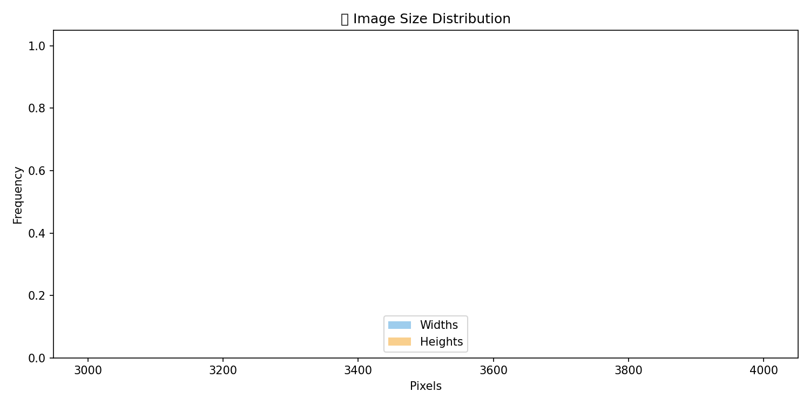
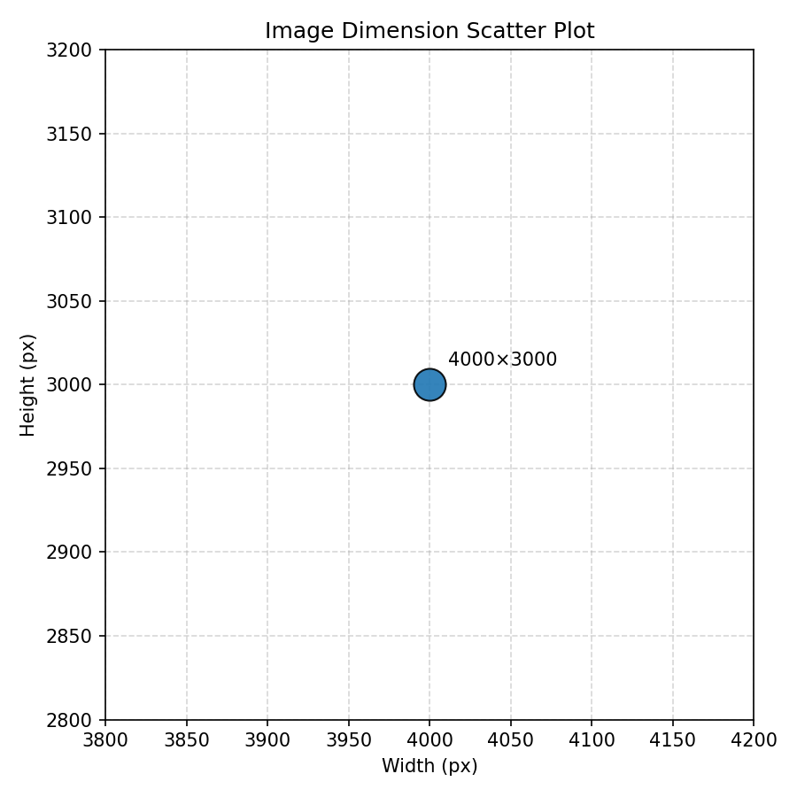
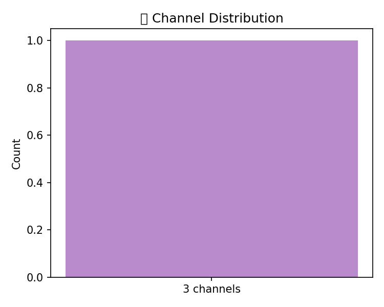

# imgshape dataset report

## Summary

- Image count: 1
- Source directory: `assets/sample_images`

## Visualizations

### Size Hist



### Scatter



### Channels



## Stats (raw)

```json
{
  "image_count": 1,
  "source_dir": "assets/sample_images"
}
```

## Preprocessing Recommendation

```json
{
  "resize": {
    "size": [
      224,
      224
    ],
    "method": "bilinear"
  },
  "normalize": {
    "mean": [
      0.485,
      0.456,
      0.406
    ],
    "std": [
      0.229,
      0.224,
      0.225
    ]
  },
  "mode": "RGB",
  "entropy": 7.341,
  "suggested_model": "MobileNet/ResNet"
}
```

## Augmentation Plan

```json
{
  "augmentations": [
    {
      "name": "RandomHorizontalFlip",
      "params": {
        "p": 0.5
      },
      "reason": "Common orientation variance; usually safe for many datasets",
      "score": 0.7
    }
  ]
}
```

---

_Report generated by imgshape_ v2.1.0_